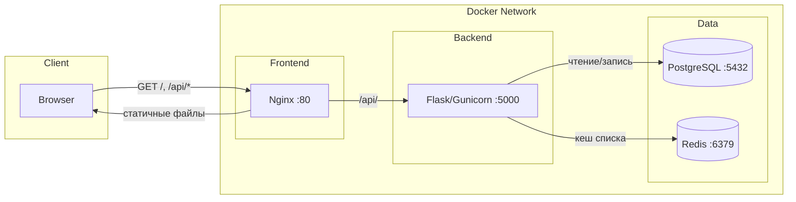

# Список задач (Tasks)

Приложение для управления задачами, собранное в Docker. Реализовано с использованием Flask, PostgreSQL, Redis и Nginx.

## Архитектура

- **Frontend** — статические HTML/CSS/JS, сервируются Nginx
- **Backend** — Flask API (gunicorn), обрабатывает CRUD-операции с задачами
- **PostgreSQL** — хранение задач
- **Redis** — кеширование списка задач (TTL 30 сек)

## Схема сервисов



**Потоки запросов:**
- `GET /` — Nginx отдаёт `index.html`
- `GET/POST /api/tasks`, `PATCH/DELETE /api/tasks/:id` — Nginx проксирует на Backend
- Backend читает/пишет задачи в PostgreSQL
- Backend кеширует результат `GET /api/tasks` в Redis на 30 секунд

## Запуск

### 1. Клонирование

```bash
git clone https://github.com/milvety8-ai/docker.git
cd docker
```

### 2. Настройка переменных окружения

```bash
cp .env.example .env
# Отредактируйте .env — задайте безопасный пароль для PostgreSQL
```

### 3. Запуск приложения

```bash
docker compose up -d --build
```

Приложение будет доступно по адресу: http://localhost

## Переменные окружения

| Переменная | Описание | По умолчанию |
|------------|----------|--------------|
| `POSTGRES_DB` | Имя базы данных | `taskdb` |
| `POSTGRES_USER` | Пользователь PostgreSQL | `appuser` |
| `POSTGRES_PASSWORD` | Пароль PostgreSQL | `changeme` (обязательно смените!) |

Backend получает дополнительно:
- `DB_HOST=postgres` — хост PostgreSQL
- `REDIS_HOST=redis` — хост Redis

## Полезные команды

| Команда | Описание |
|---------|----------|
| `docker compose up -d --build` | Собрать образы и запустить все сервисы в фоне |
| `docker compose down` | Остановить и удалить контейнеры |
| `docker compose down -v` | Остановить контейнеры и **удалить тома** (см. ниже) |
| `docker compose logs -f` | Просмотр логов всех сервисов в реальном времени |
| `docker compose logs -f backend` | Логи только backend |
| `docker compose exec backend sh` | Войти в shell контейнера backend |
| `docker compose exec postgres psql -U appuser -d taskdb` | Подключиться к PostgreSQL |

## docker compose down -v

Флаг `-v` (или `--volumes`) **удаляет именованные тома**, объявленные в `volumes:`.

В данном проекте используется том `postgres-data` для хранения данных PostgreSQL. При выполнении `docker compose down -v`:

- все данные в базе (задачи, пользователи) будут **удалены**
- при следующем `docker compose up` PostgreSQL создаст **пустую** базу и инициализирует её заново

**Когда использовать:**
- для полного сброса приложения
- при смене пароля PostgreSQL (после первого запуска пароль нельзя изменить без пересоздания данных)
- при серьёзных проблемах с БД

**Когда не использовать:**
- если нужно сохранить задачи и другие данные — используйте `docker compose down` без `-v`
